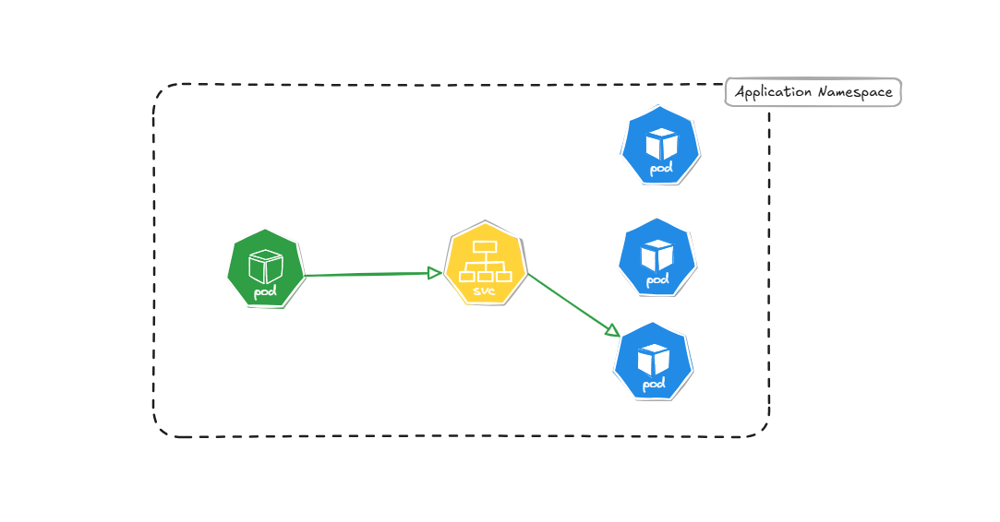
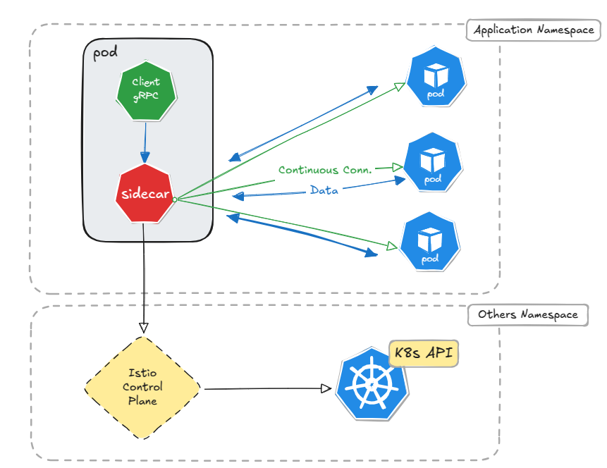
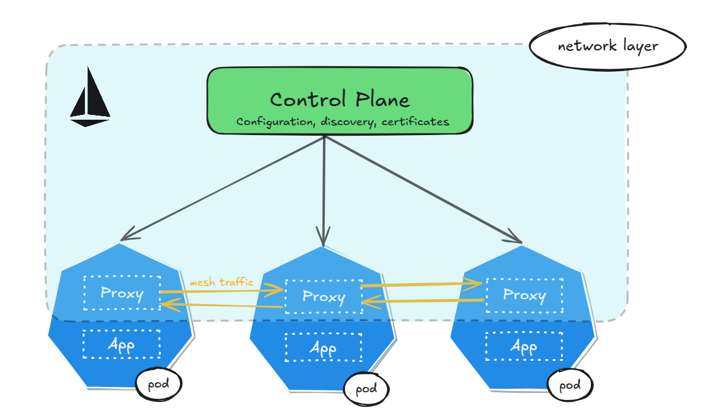
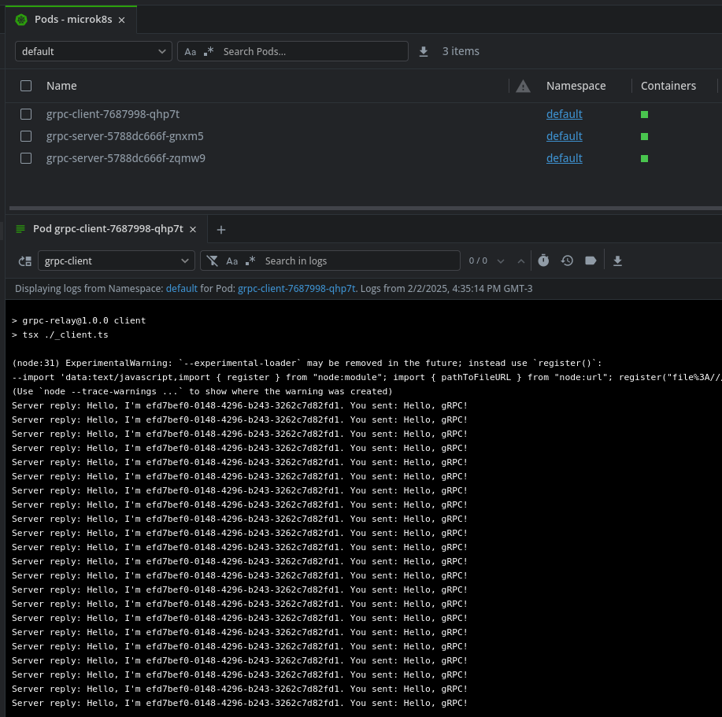
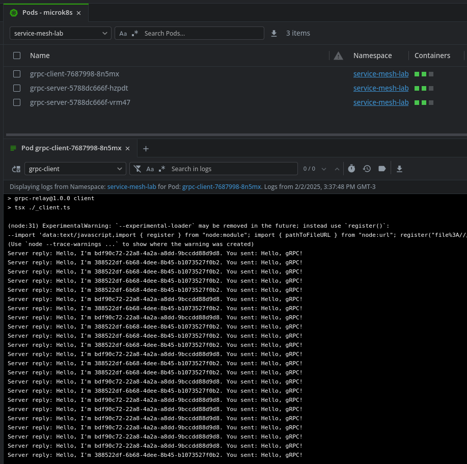

# Load Balancing gRPC traffic with Istio

> Originally published on dev.to on 2025-02-17 —
> <https://dev.to/visepol/load-balancing-grpc-traffic-with-istio-1k49>
>
> This file is the copy kept in the repository. The images were downloaded and are
> served from `images/`.

gRPC has gained a lot of popularity for building microservices. Because it is based on persistent HTTP/2 connections, it offers advantages over regular HTTP calls, such as multiplexing requests over a single connection. However, this protocol’s load balancing may not work out of the box in the Kubernetes environment.


--- 
## ⚠️ Houston we have a problem


When working with tens of millions of messages whose traffic needs to be as quick as possible in real-time, indicators such as ***SLA*** (Service Level Agreement) become a major concern. And, as the volume grows, performance degrades, requiring more infrastructure scalability and, in turn, a smaller profit margin. One strategy to optimize the internal network and avoid spending on resources would be to replace all HTTP 1.1 connections between microservices with a single gRPC connection.

### gRPC
gRPC is a remote procedure call framework created by Google based on HTTP/2. It can set an interface and serialize data through a Protocol Buffer, a binary format less heavy than the PLAIN TEXT format of HTTP 1.1. With gRPC, you set the methods and the types by creating files `.proto`. These files can be used to automatically generate the client and the server code for a lot of languages. Additionally, as mentioned, it multiplexes requests into a single connection, which creates less network overhead and speeds up communication.

### Why do the L4 proxies struggle when operating with gRPC?



 
The above diagram suggests a common use case for traffic balancing. The green pod sees the `SVC`, which sees the other blue pods. This should be enough to do a simple round-robin when we are talking about conventional HTTP. But here we are talking about HTTP/2, which establishes a long-lived connection, through which all requests must pass to reach their destination. Load balances that operate at layer four of [**the OSI model**](https://en.wikipedia.org/wiki/OSI_model) (L4) only decide the destination at the beginning of the connection, all subsequent requests under this connection will go to the same server, which leads to poor load distribution. L4 proxies handle connections, not requests. They have no visibility of what happens inside the connection.

### How do we operate over the L7 layer?  
  


Proxies operating at this layer have visibility into the packet content and can make different decisions regarding the delivery destination. This is where Istio comes in. Istio can provide a service mesh that deploys proxies as sidecar containers alongside the application container. Instead of a centralized entry point, the sidecar interacts with the Istio control plane, which in turn interacts directly with the Kubernetes API to retrieve the destination endpoints. In this way, the sidecar establishes a continuous and direct connection to all available endpoints, and then performs routing based on the rules that are defined.

---
## 🌐 Istio: The Service Mesh

  
What is it? Istio is a service mesh. And to understand what this means, we need to understand what a service mesh is. 

A service mesh is a widely used solution to manage communication between microservices individually. It solves problems such as poor load balancing by operating at the application layer, and also adds retries in case of communication failure, traffic metrics, and security.

Using a sidecar, all these responsibilities are abstracted and the application only needs to worry about the logical layer in its implementation. This is done through the Istio Control Plane, which injects a sidecar proxy container into the pod along with the application. The applications now communicate with each other through these proxies. This network layer is composed of: a control plane and proxies, that is the service mesh.



---
## 🛠️ Hands-On


In a local environment, for demonstration purposes, I am using MicroK8s, maintained by Canonical. In production environments, add-ons can be installed by tools such as Helm. In MicroK8s, add-ons can be enabled directly from the command line.

First, let's enable third party and community maintained add-ons with the following command:

```sh
microk8s enable community
```

And then, enable Istio by running:

```sh
microk8s enable istio
```

This should add:

✔ **Istio core installed**                                                                
✔ **Istiod installed**                                             
✔ **Egress gateways installed**                                                 
**✔ Ingress gateways installed**                                                        
**✔ Installation complete**

Now let's set up a namespace for the lab. It will be named `serivce-mesh-lab`.

```yaml
microk8s kubectl apply -f - <<EOF
apiVersion: v1
kind: Namespace
metadata:
  name: service-mesh-lab
  labels:
    istio-injection: enabled
EOF
```
  
>ℹ️ _Notice that there is a label called **istio-injection** with the value set to **enabled**. This label is how the Istio Control Plane knows that it will need to inject a sidecar proxy into the pods under this namespace._

### Building the gRPC application

  
I have made available a repository that performs message transmission between client and server via gRPC in a simple way. Clone the repository using the following command:  
  
```sh
git@github.com:visepol/grpc-relay.git
```

Now it is necessary to build the images.  
  
To build the client, run:  
```sh
docker build -t grpc-client:local --build-arg APP_MODE=client .
```
  
To build the server run:
```sh
docker build -t grpc-server:local --build-arg APP_MODE=server .
```

### Adding an image to the local registry

Kubernetes is not aware of the newly built images. We can export the built image from the local Docker daemon and import it into the MicroK8s local registry like this:

```sh
docker save grpc-client:local > grpc-client.tar
```

```sh
docker save grpc-server:local > grpc-server.tar
```
 
and then import with:

```sh
microk8s ctr image import grpc-client.tar
```

```sh
microk8s ctr image import grpc-server.tar
```

Finally, we can deploy the applications for analysis in two namespaces.
  
The first will be in the default namespace, where we will use the default L4 proxy to distribute messages.  

```sh
microk8s kubectl apply -f ./kubernetes -n default
```

The second will be in the namespace we created, service-mesh-lab, where the proxies will be injected as a sidecar to operate in L7.

```sh
microk8s kubectl apply -f ./kubernetes -n service-mesh-lab
```

---
## 🎥 Demo


### A look at the Code  

The code below shows the contents of the gRPC Server. Note that on line 6 a UUID is generated to identify the message receiver in the gRPC Client. Next, the `IExampleServer` interface is implemented on line 12, ensuring adherence to the contract defined in `.proto`. The service is then added to the server on line 33, making the methods available to the client. On line 40 I use `.createInsecure()` to make the Demo easier. In production environments, the use of TLS is ideal.

The code ([on Github](https://github.com/visepol/grpc-relay/blob/main/_server.ts)):
```typescript
import * as grpc from '@grpc/grpc-js'
import { IExampleServer, ExampleService } from './generated/example_grpc_pb'
import { DataResponse } from './generated/example_pb'
import { randomUUID } from 'crypto'

const uuid = randomUUID()

/**
 * Implements the ExampleService defined in the proto file.
 * @type {IExampleServer}
 */
const exampleService: IExampleServer = {
  /**
   * Handles the sendData RPC call.
   * @param {grpc.ServerUnaryCall<DataRequest, DataResponse>} call - The call object containing the request.
   * @param {grpc.sendUnaryData<DataResponse>} callback - The callback to send the response.
   */
  sendData: (call, callback) => {
    console.log('Received message:', call.request.getMessage())
    const response = new DataResponse()
    response.setReply(
      `Hello, I'm ${uuid}. You sent: ${call.request.getMessage()}`,
    )
    callback(null, response)
  },
}

const server = new grpc.Server()

/**
 * Adds the ExampleService to the gRPC server.
 */
server.addService(ExampleService, exampleService)

/**
 * Binds the server to the specified address and starts it.
 */
server.bindAsync(
  '0.0.0.0:50051',
  grpc.ServerCredentials.createInsecure(),
  () => {
    console.log(
      "Server's up—smooth as a race car! 🏎️💨",
    )
  },
)
```

The code below shows the content of the gRPC Client. In line 10 I use the K8s metadata to set the `SVC` that I should point to and in line 11 I avoid the use of TLS again. The request is instantiated from the model generated by ProtoBuff in line 18. And finally, in line 23, I define the continuous sending of messages within a 10-second window.

The code ([on Github](https://github.com/visepol/grpc-relay/blob/main/_client.ts)):
```typescript
import * as grpc from '@grpc/grpc-js'
import { ExampleClient } from './generated/example_grpc_pb'
import { DataRequest } from './generated/example_pb'

/**
 * Creates a new gRPC client for the ExampleService.
 * @type {ExampleClient}
 */
const client: ExampleClient = new ExampleClient(
  `grpc-service.${process.env.K8S_NAMESPACE}.svc.cluster.local:50051`,
  grpc.credentials.createInsecure(),
)

/**
 * Creates a new DataRequest object.
 * @type {DataRequest}
 */
const request: DataRequest = new DataRequest()

/**
 * Sends a message to the gRPC server every 10 seconds.
 */
setInterval(() => {
  request.setMessage('Hello, gRPC!')
  client.sendData(request, (error, response) => {
    if (error) {
      console.error(error)
      return
    }

    console.log(`Server reply:`, response.getReply())
  })
}, 10 * 1000)
```  

### Results

Let's analyze the communication established in the default namespace:

✳️ Each pod contains only one container, indicated by the single green square in the containers column. This indicates that the application is running stand-alone.
    
✳️ The client gRPC received messages only from the server with UUID `efd7bef0-0148-4296-b243-3262c7d82fd1`. Once the connection was established all responses were issued by the same gRPC server.



Let's analyze the communication established in the service-mesh-lab namespace:

✳️ There were three containers inside each pod. An ephemeral container for sidecar injection, a container that remains alive and running which is the injected proxy, and another standing container which is the application itself.
    
✳️ The Server reply that is logged by the gRPC client indicates different UUIDs. This means that more than one gRPC server is responding to the same client.



---
## 🚦 Advanced Routing & Balancing


Istio allows you to configure load balancing and routing through [DestinationRules](https://istio.io/latest/docs/reference/config/networking/destination-rule/) and [VirtualServices](https://istio.io/latest/docs/reference/config/networking/virtual-service/). Configurations are defined through YAML manifests and you can choose between different load balancing algorithms, such as round-robin or least-conn. As for routing, Istio allows you to direct traffic based on headers, paths, and other criteria to different subsets of a service. Explore more about these and other features by browsing [the official documentation.](https://istio.io/latest/docs/reference/config/networking/)

---
## ✅ Final Considerations


gRPC is a great solution for improving the speed of your internal network, but to get the most out of the solution, you need to provide an environment that meets the requirements. Istio is a great way to make your network more robust, providing a service mesh standard with proxies acting on layer seven of the OSI model. This ensures not only the proper balancing of packet traffic in persistent connections but also promotes security with internal encryption, traffic metrics, and more routing strategies.

### References:
[https://en.wikipedia.org/wiki/OSI_model](https://en.wikipedia.org/wiki/OSI_model)
[https://grpc.io/blog/grpc-load-balancing/](https://grpc.io/blog/grpc-load-balancing/)
[https://istio.io/latest/docs/overview/what-is-istio/](https://istio.io/latest/docs/overview/what-is-istio/)
[https://istio.io/latest/docs/setup/platform-setup/microk8s/](https://istio.io/latest/docs/setup/platform-setup/microk8s/)
[https://istio.io/latest/docs/reference/config/networking/](https://istio.io/latest/docs/reference/config/networking/)
[https://istio.io/latest/docs/reference/config/networking/destination-rule/](https://istio.io/latest/docs/reference/config/networking/destination-rule/)
[https://istio.io/latest/docs/reference/config/networking/virtual-service/](https://istio.io/latest/docs/reference/config/networking/virtual-service/)
[https://microk8s.io/docs/addons](https://microk8s.io/docs/addons)
[https://microk8s.io/docs/registry-images](https://microk8s.io/docs/registry-images)